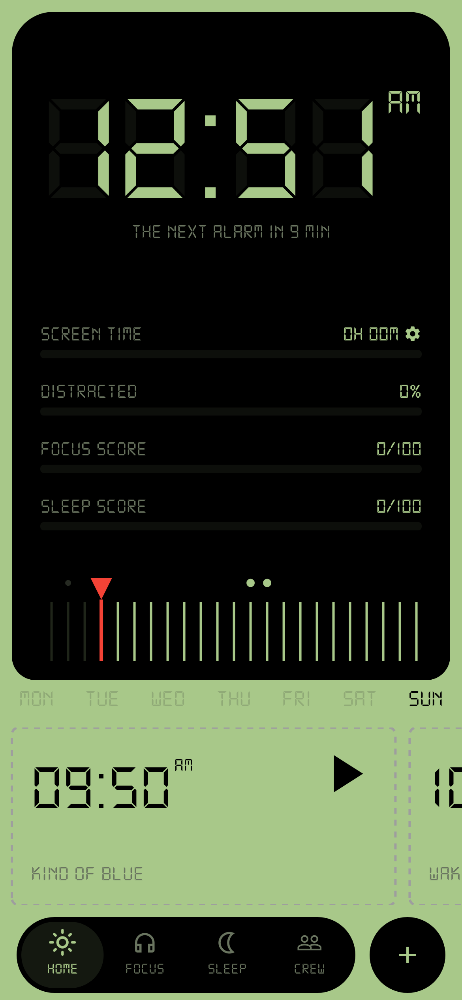
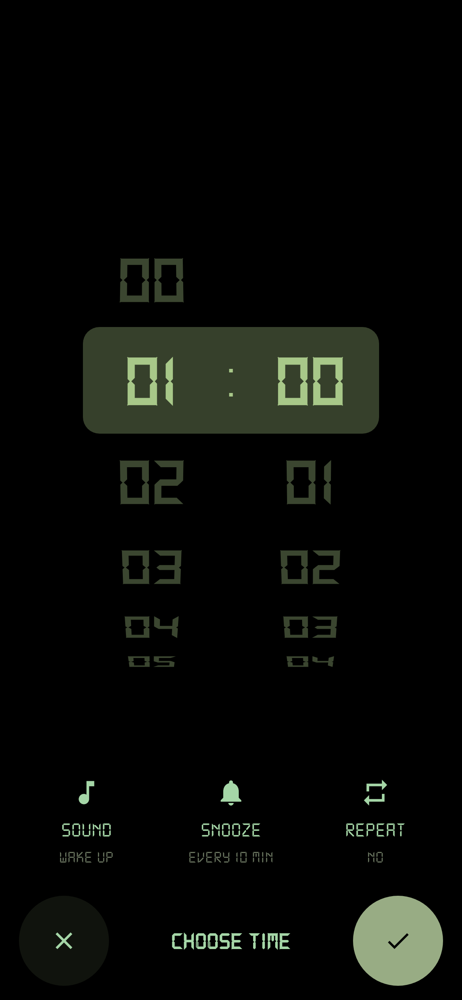
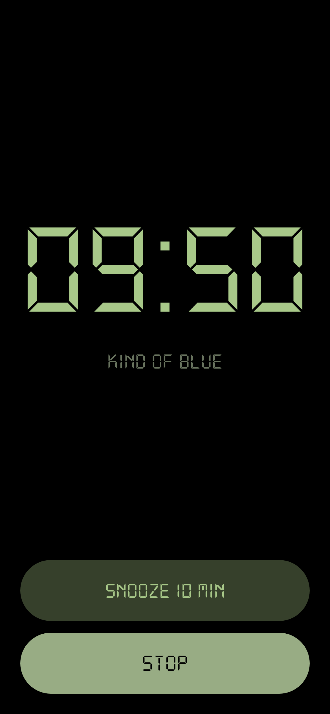
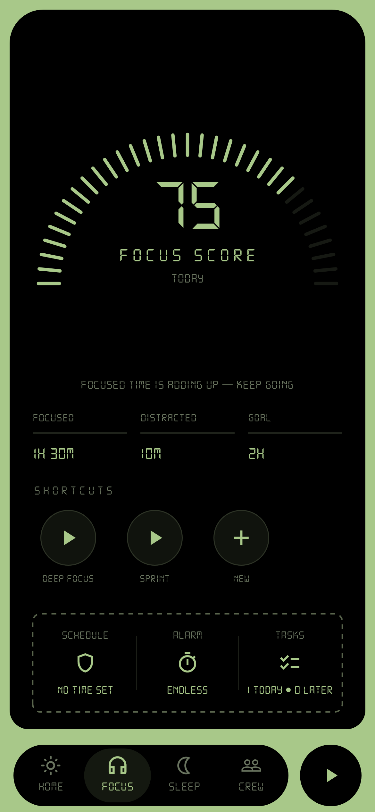

# MFAAA

*A relentless alarm clock for Android.*

## Features

- **Alarms** — Create, edit, delete, toggle. Once / daily / weekdays. Configurable snooze (5–15 min). Full-screen ring with pulse + haptics.
- **Focus Timer** — Endless, Pomodoro, or alarm-timed. Distraction tracking, task lists, app blocking.
- **Sleep Timer** — Quick nap or alarm-timed sessions.
- **App Blocker** — Accessibility Service overlay blocks distracting apps. Strict mode prevents early exit.
- **Screen Time** — Per-day phone usage breakdown by app.
- **Live Dashboard** — Clock, alarm cards, stats (focus score, sleep score, distraction %).

## Screenshots

<p float="left">
  
  
  
  

</p>

## Packages

| Package | Purpose |
|---------|---------|
| `shared_preferences` | JSON persistence |
| `flutter_local_notifications` | Alarm scheduling |
| `timezone` / `flutter_timezone` | TZ-aware scheduling |
| `app_usage` | Screen time (Android) |
| `android_intent_plus` | Launch system settings |

## Structure

```
lib/
├── main.dart
├── models/
│   ├── alarm.dart            # Alarm, AlarmDraft, AlarmRepeat, nextFire()
│   └── session.dart          # SessionKind/Mode/Config, FocusTask, DayStats
├── pages/
│   ├── clock_dashboard.dart   # Main screen, live clock, alarm cards, stats, 4-tab nav
│   ├── alarm_ring_page.dart   # Full-screen ring page (snooze / stop)
│   ├── time_wheel_page.dart   # Alarm time picker (wheels + sound/snooze/repeat)
│   ├── session_page.dart      # Active focus/sleep timer with controls + blocking
│   ├── session_tabs.dart      # Focus/Sleep dashboard panels with gauges + presets
│   └── screen_time_details_page.dart  # Per-day app usage breakdown
├── services/
│   ├── alarm_store.dart       # Alarm CRUD, 1s ticker, firing logic, persistence
│   ├── session_store.dart     # Session recording, presets, tasks, blocking config
│   ├── notification_service.dart  # flutter_local_notifications scheduling
│   ├── app_blocker.dart       # MethodChannel → Android AccessibilityService
│   ├── app_icons.dart         # MethodChannel → app icon PNGs
│   └── device_usage.dart      # app_usage wrapper
└── widgets/
    ├── tactile.dart            # Press-scale animation
    ├── lcd_gauge.dart          # Arc gauge widget
    ├── timer_sheet.dart        # Timer config bottom sheet
    ├── minute_ruler.dart       # Horizontal minute selector
    └── slide_up_route.dart     # Fade+slide page transition
```

## Permissions

| Permission | Why |
|-----------|-----|
| `POST_NOTIFICATIONS` | Display alarms |
| `SCHEDULE_EXACT_ALARM` | Precise timing |
| `USE_EXACT_ALARM` | Android 14+ exact alarm |
| `WAKE_LOCK` | Wake device on alarm |
| `RECEIVE_BOOT_COMPLETED` | Re-schedule after reboot |
| `PACKAGE_USAGE_STATS` | Screen time tracking |
| `BIND_ACCESSIBILITY_SERVICE` | App blocking overlay |

## Build & Test

```bash
flutter pub get
flutter run
flutter build apk --release
flutter test
```

**Status:** WIP
